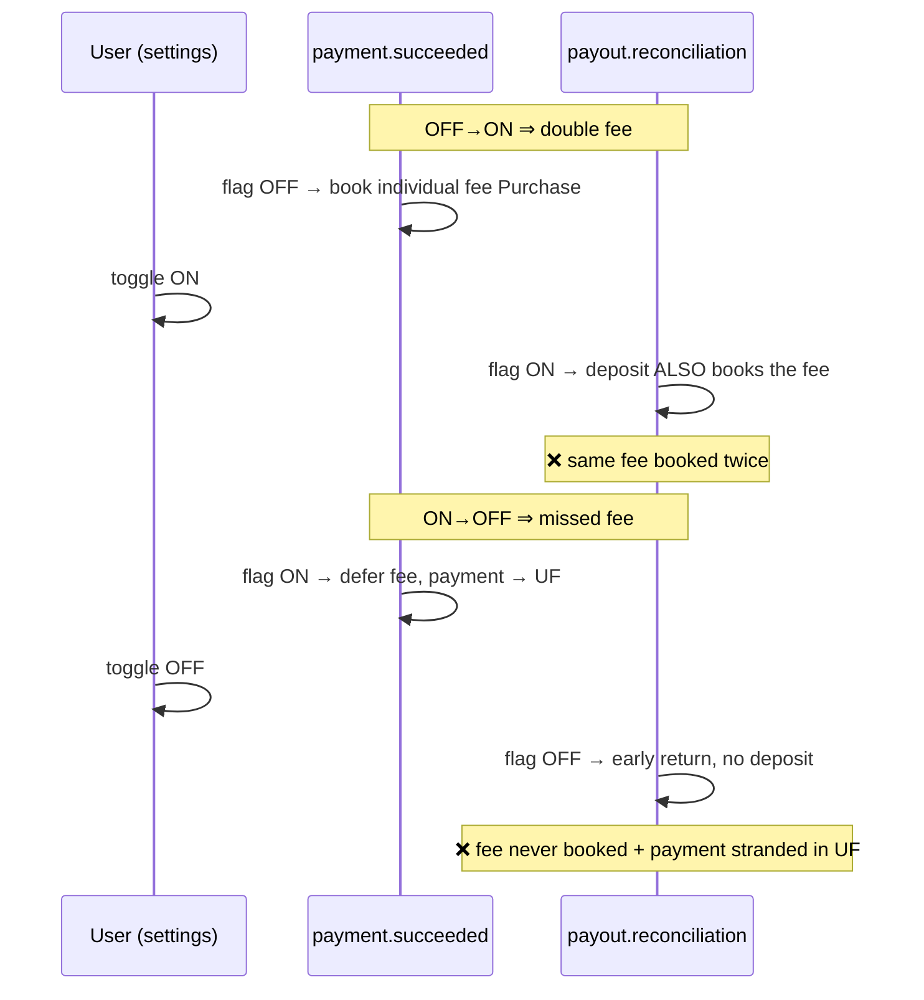
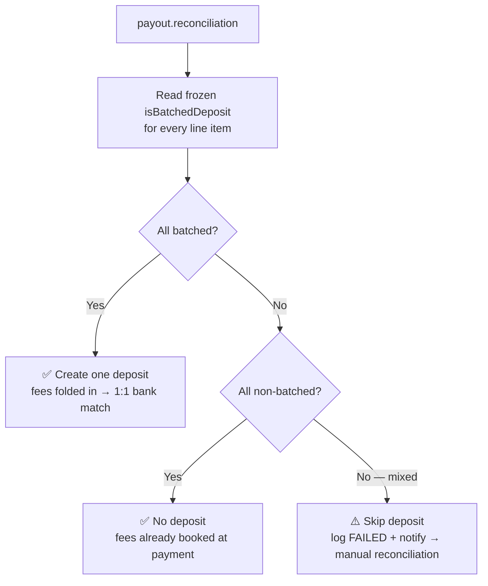

# Batched-deposit fee edge case (OUT-4009)

## The setup

Two settings control how Stripe fees land in QuickBooks:

- **`absorbedFeeFlag`** — book the Stripe fee as an expense.
- **`bankDepositFeeFlag`** (the "batched-deposit" flag) — decides **who** books that fee:
  - **OFF** → fee booked immediately at `payment.succeeded` as an individual QBO **Purchase**.
  - **ON** → fee is deferred; the payment parks in **Undeposited Funds (UF)**, and one QBO **Bank Deposit** per Stripe payout books the fee later.

> **UF (Undeposited Funds)** is a QuickBooks holding account — a "waiting room". Payments sit there until a Bank Deposit sweeps them into the real bank account. That deposit is what matches the bank feed 1:1.

## The bug

The flag is read **live** at two different moments — once at `payment.succeeded`, once at `payout.reconciliation`. If the user toggles it in between, the two disagree:

- **OFF → ON:** fee booked at payment time **and** again in the deposit → **fee booked twice.**
- **ON → OFF:** payment parked in UF, but the payout handler returns early → **fee never booked + payment stranded in UF.**

## The fix

**Freeze the decision per invoice.** When the payment routing is decided, store `isBatchedDeposit` on the invoice-sync row. Both handlers read that frozen value instead of the live flag.

At payout time the decision is **all-or-nothing** by frozen intent:

## Why "mixed" can't be auto-handled

A single Stripe payout can straddle a toggle, mixing batched and non-batched invoices. There's no way to render that as one balanced deposit without either double-booking a fee, breaking the 1:1 bank match, or destructively deleting already-booked Purchases (and there is **no `deleteDeposit`** to undo mistakes). So a mixed payout is quarantined for manual reconciliation instead of guessed.

A settings dialog warns users that toggling mid-cycle can leave one payout needing manual reconciliation — but that's UX only; correctness comes from the frozen intent above.
